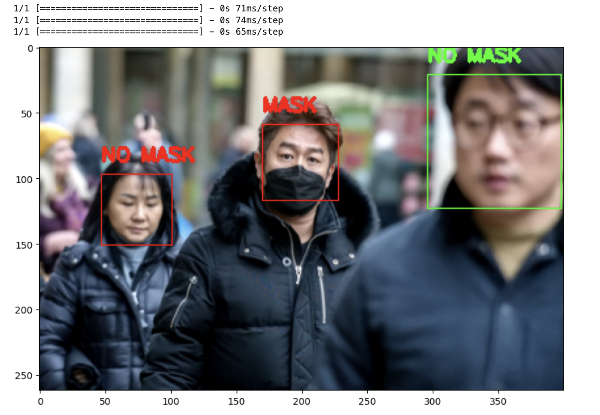

# Mask Detection & Social Distance Monitoring

This repository contains projects for mask detection and social distance monitoring using computer vision techniques. These projects aim to contribute to public health and safety by detecting whether individuals are wearing masks and monitoring adherence to social distancing guidelines.

## Facial Mask Detection

The facial mask detection project utilizes deep learning techniques, specifically transfer learning with the VGG19 convolutional neural network architecture. It involves the following key components:

- **Data Preparation**: Utilizes the `ImageDataGenerator` class from Keras to preprocess and augment image data.
- **Transfer Learning**: Utilizes the pre-trained VGG19 model as a feature extractor and adds custom fully connected layers for mask classification.
- **Training and Evaluation**: Trains the model on a dataset of images with and without masks and evaluates its performance using accuracy and loss metrics.
- **Prediction**: Demonstrates how to use the trained model to predict whether a person is wearing a mask in an image.

To run the Facial Mask Detection project, execute `train.py` to build and save the model. After training for 10 epochs, the model will be saved as `masknet_10_epoch.h5`.

Ensure that the path to the cascade classifier (`face_model`) in `train.py` is correct for your system.

Make sure to update the file paths in `train.py` to point to the correct directories containing your dataset. Adjust the `train_dir`, `test_dir`, and `val_dir` variables to match the locations of your training, testing, and validation data, respectively.

## Proximity Analysis with OpenCV

This notebook demonstrates social distance monitoring using OpenCV. It utilizes the Haar Cascade classifier to detect faces in images and subsequently applies distance metrics to determine if social distancing guidelines are being followed.

### Contents:
1. **Face Detection**: Utilizes the Haar Cascade classifier (`haarcascade_frontalface_default.xml`) to detect faces in an image.
2. **Proximity Analysis**: Measures the distance between detected faces to determine if they adhere to social distancing guidelines.
3. **Visualization**: Visualizes the results by drawing bounding boxes around detected faces and highlighting violations of social distancing.

### Instructions:
- Ensure that the Haar Cascade classifier file (`haarcascade_frontalface_default.xml`) is present in the same directory as the notebook.
- Load an image using `cv2.imread()` and apply grayscale conversion using `cv2.cvtColor()` if necessary.
- Use `face_model.detectMultiScale()` to detect faces in the image. Adjust parameters like `scaleFactor` and `minNeighbors` as needed.
- Analyze the detected faces to determine social distance violations using appropriate distance metrics.
- Visualize the results by drawing bounding boxes around faces and highlighting violations of social distancing.

## Mask Detection with Single Image Prediction

This Jupyter notebook (`predict_single_image.ipynb`) demonstrates how to use a trained mask detection model to predict whether a person is wearing a mask in a single image.

### Contents:
1. **Model Loading**: Loads the pre-trained mask detection model (`masknet_10_epoch.h5`).
2. **Image Preprocessing**: Reads and preprocesses a sample image of a person wearing a mask.
3. **Prediction**: Uses the loaded model to predict whether the person in the image is wearing a mask or not.
4. **Visualization**: Displays the sample image and prints the predicted accuracy of wearing and not wearing a mask.

### Instructions:
1. Ensure that the trained model file (`masknet_10_epoch.h5`) and the sample image are located in the specified directories.
2. Load the model using `tf.keras.models.load_model()` and provide the path to the model file.
3. Read the sample image using `cv2.imread()` and preprocess it for prediction.
4. Use the loaded model to predict whether the person in the image is wearing a mask.
5. Visualize the sample image and the predicted accuracy of wearing and not wearing a mask.

### Note:
- This repository provides a simple example of using a trained mask detection model for single image prediction. Further customization and integration may be necessary for specific applications or use cases.
  
- Ensure that the file paths and dependencies are correctly set up before running the notebook.

